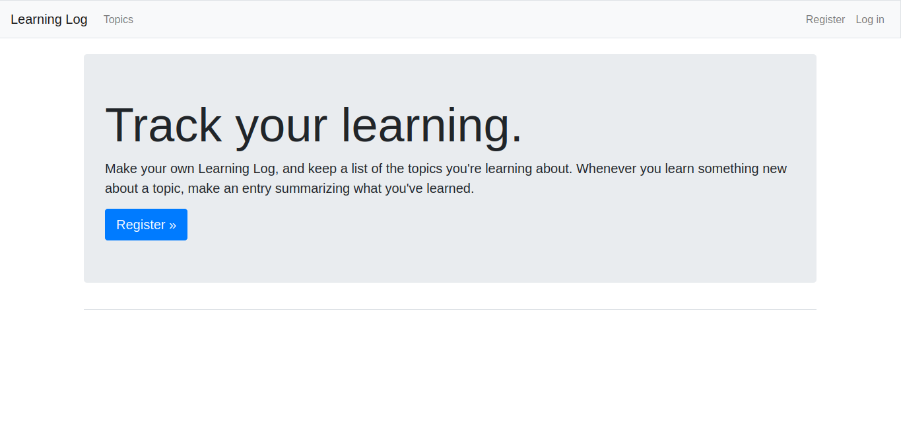

# Learning-Log

This is training project wrote by Django & Bootstrap framework.
It's support next features:
- Users registration and athentication;
- Each user may create own topic;
- Each topic may contain many entries that can be modified by owner;
## Requirements
- Anaconda 23.7.4
- Python 3.12.0
- Django 4.1
- Docker 24.0.7
## Development 
- `git clone git@github.com:barabashka25219/Learning-Log.git` (SSH)
- `git clone https://github.com/barabashka25219/Learning-Log.git` (HTTPS)
- `conda env create -f environment.yml`
- `conda activate LearningLog`
### Add package 
- `conda install -n LearningLog $PACKAGE[=$VERSION]`
> You can search a package via `conda search $PACKAGE`
>> Make sure that the package is installed via `conda list -n LearningLog $PACKAGE`
- `cd Learning-Log`
- `conda env export > environment.yml`
- `git commit -m "Add $PACKAGE in environment"`
- `git push origin $BRANCH`
## Docker
### Creation
- `conda activate LearningLog`
- `cd Learning-Log/learning_logs`
- `pip list --format=freeze > requirements.txt`
- `docker build -t barabashka25219/learninglog .`
### Run container
- `docker run -d -p 8000:5000 --name learninglog barabashka25219/learninglog`
